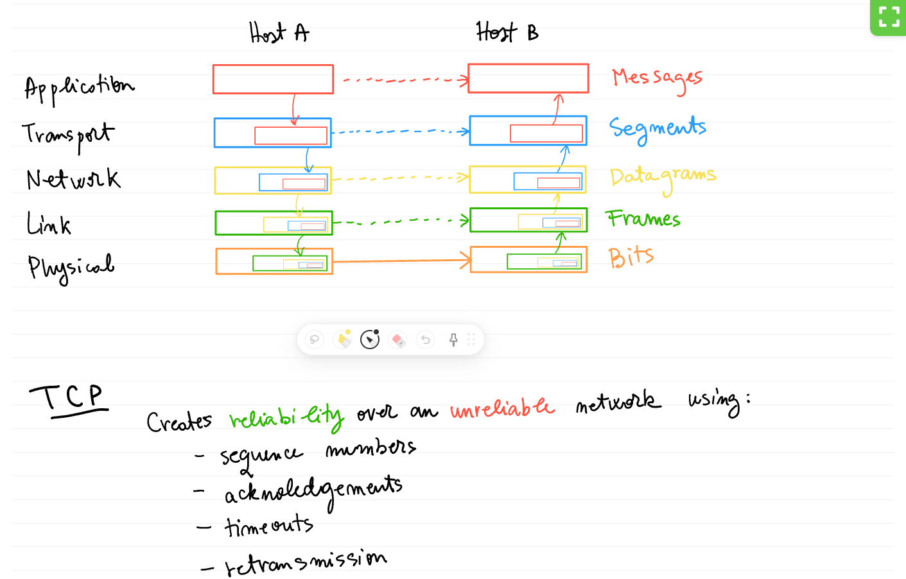
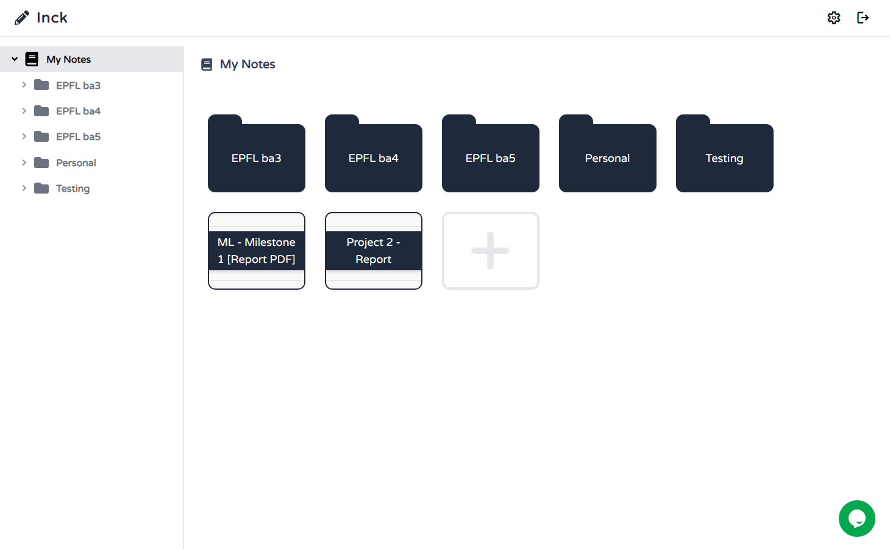

# Inck

Space efficient, time efficient, web-based note taking app with real time collaboration.

Built in Next.js using WebGL and web sockets.

# Screenshots






Try it out at [inck.io](https://inck.io)

# Contents

- [Dependencies](#dependencies)
- [Installation](#installation)
- [Usage](#usage)
- [Deployment](#deployment)
- [Other](#other)
- [License](#license)

# Dependencies

Node.js, MongoDB, Redis, as well as a few Node.js packages.

# Installation

1. Install [MongoDB](https://www.mongodb.com/try/download/community)

```
brew install mongodb
mkdir -p /data/db
sudo chown -R `id -un` /data/db
mongod
```

2. Install [Node.js & NPM](https://nodejs.org/en/download/)
3. Install and start [redis](https://redis.io/)

```
brew install redis
redis-server
```

4. Open the project in command-line
5. Install server and client dependencies using `npm install`
6. Start project in development mode using `npm run dev-all`

# Usage

Open your browser and go to https://localhost:3080.

# Deployment

This project has 3 components: server, client, and common types.

Build everything with `npm run build-all`.

Start everything with `npm run start-all` or just the server/client with `npm run start-server` and `npm run start-client`

## PM2

The app is deployed using [PM2](https://pm2.keymetrics.io/docs/usage/startup/) on an Amazon EC2 virtual machine. There are two processes: "client" and "server". Both processes start automatically after a reboot.

## Cheatsheet

Restart processes using

- `pm2 restart server`
- `pm2 restart client`
- `pm2 restart all`
- don't forget to rebuild the client if changed by running `npm run build` in client folder

Reset restart counters using

- `pm2 reset all`

Processes were created by running the following commands in the apropriate folders:

- `pm2 start "npm run start" --name server`
- `pm2 start "npm run start" --name client`

## Ports

The frontend is running on port 3080, not 80, due to permission issues.

Traffic is redirected from port 80 to 3080 with the following command:

`sudo iptables -t nat -A PREROUTING -p tcp --dport 80 -j REDIRECT --to-port 3080`

This command is scheduled to run at startup automatically using chromtab `crontab -e` command, read more about chrontab [here](https://askubuntu.com/questions/814/how-to-run-scripts-on-start-up).

# Other

See number of lines of code using `npm run line-count`.
